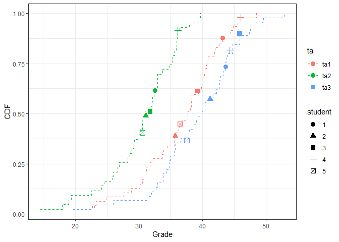
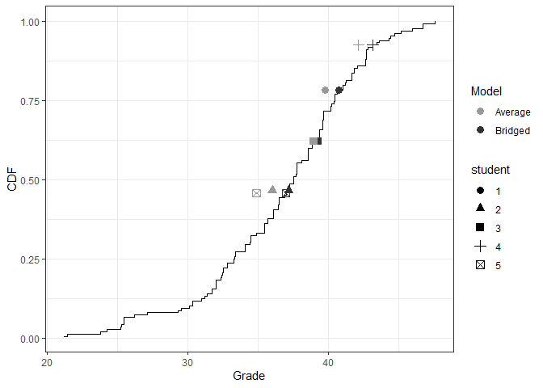

# Introduction

When large survey courses rely on multiple professors or teaching
assistants to judge student responses, grading bias can occur. This R
package enables instructors to identify and correct for bias in grading
data using a Bayesian version of the Aldrich Mckelvey algorithm. The
package supports various configurations of the assessment scale, the
number of graders, and the number of total students. A description of
the method is contained in Kates, Paulsen, Tucker, and Yntiso (2022)
\`\`Bridging the Grade Gap: Reducing Assessment Bias in a Multi-Grader
Class.”

# Authors

[Sean Kates](https://wp.nyu.edu/seankates/)

[Tine Paulsen](https://www.tinepaulsen.com)

[Sidak Yntiso](https://sidakyntiso.github.io/) (Maintainer)

[Josh Tucker](https://wp.nyu.edu/fas-joshuatucker/)

# Installation Instructions

`bridgr` can be installed:

    # From CRAN
    # install.packages("bridgr")

    # From Github
    # Install devtools if necessary
    # if (!"devtools" %in% rownames(installed.packages())){
    #     install.packages("devtools")
    # }
    # # Install bridgr
    # devtools::install_github("sidakyntiso/bridgr")

# Load Data

    library(bridgr)
    data("bridgr.sim.data")

# Evidence of Systematic Bias in Grading

    # Re-structure the input grading dataset.
    bridgr.dat <- bridgr.data(df=bridgr.sim.data,student="student",
                              grader.assigned = "grader.assigned",grader="grader",grade="grade")

    # Visualize grading bias using bridging observations
    grading.bias.pre = bridgr.eval.bias(bridgr.dat=bridgr.dat,plot=T,tbl=F)

The figure above shows the empirical cumulative distribution function
(CDF) for grades by grader. The y-axis marks the fraction of grades
equal to or less than the corresponding grade on the x-axis.

If there were no bias, we might expect that the curves would overlap
perfectly. Instead, some graders rarely assign top scores (leftmost
curve), and some graders rarely assign low scores (rightmost curve).
Graders may also differ in the rate at which the probability of
assigning higher grades increases across grades (the slopes).

We turn to the **commonly graded students**, depicted as points in the
figure, to solve this problem. In a no-bias world, each student would
receive the same grade from each grader. Instead, some students perform
systematically more poorly in raw scores (i.e., the horizontal
difference for each student) than they would have with a different
grader. Moreover, many students would do better in rank placement than
other students depending on their section (i.e., the vertical difference
for each student).

While specific graders are too strict or too lenient, we might think
that the average across graders is a reasonable estimate of the
students’ scores. Averaging removes systematic grading bias associated
with each grader. Treating the average as the “true grade,” the table
below compares how far each student’s grade is from the true grade. We
find a large difference between the lowest and highest grade a student
might get, depending upon their grader.

Specifically, the table tabulates the mean absolute error (MAE) and the
root mean squared error (RMSE). Bias is apparent in the assigned grader
scores and the implied ranks (among commonly graded students). Further,
an analysis of variance F-test suggests that the grader distributions
are significantly different. Therefore, evidence from the commonly
graded students suggests that the traditional grading techniques may
produce significant grading bias in this class.

    # Evaluate grading bias using bridging observations
    bridgr.eval.bias(bridgr.dat=bridgr.dat,plot=F,tbl=T)
    #> 
    #>   Grading Bias for Bridging Students           
    #> -----------------------------------------------
    #>            MAE    RMSE   F-statistic   Pr(>F)  
    #>   Grades   3.75   4.30   11.97         0.001   
    #>   Ranks    0.40   0.63                         
    #> -----------------------------------------------
    #>   Bounds MAE Rank: [0,2.4]                     
    #>   Bounds RMSE Ranks: [0,2.83]                  
    #>   __________________                           
    #>   Grading Parameters                           
    #>   # Exams: 135; # Graders: 3                   
    #>   # Bridges: 5; # Missing: 0

Can we do better?

# Bridging the Grade Gap

    # Evaluate grading bias using bridging observations.
    # bridgr.sim.results = bridgr(bridgr.dat=bridgr.dat,min_grade=NA,max_grade=NA)

    # Load pre-processed results
    data("bridgr.sim.results")

    # Access student identifiers
    head(bridgr.sim.results$student_id)
    #> [1]  3  4  7  9 10 13

    # Access the corrected grades
    head(bridgr.sim.results$corrected_grades)
    #>        3        4        7        9       10       13 
    #> 36.92617 27.10109 41.84941 25.45499 36.11471 40.78159

    # Access the corrected ranks
    head(bridgr.sim.results$corrected_ranks)
    #>   3   4   7   9  10  13 
    #>  61  11 115   8  55 106

    # Evaluate improvements among commonly graded students
    grading.bias.post = bridgr.eval.post(bridgr.results = bridgr.sim.results,plot = T, tbl = F)

