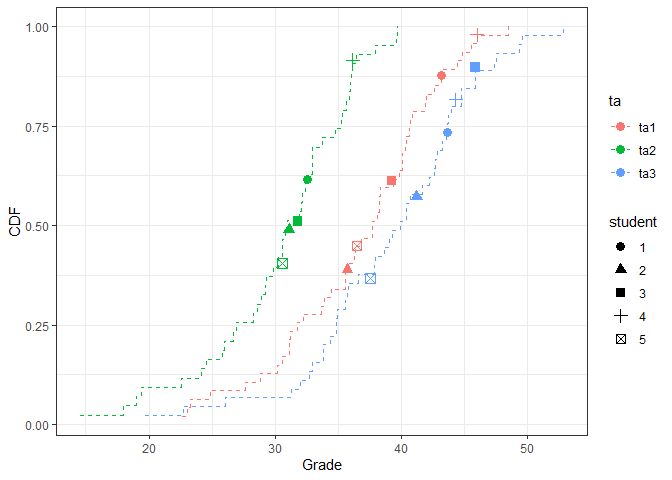
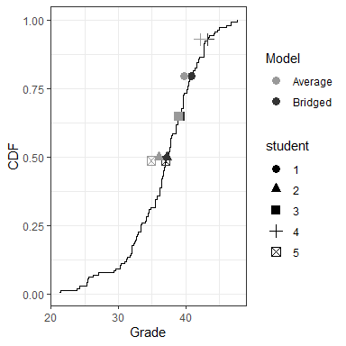

<!-- README.md is generated from README.Rmd. Please edit that file -->

# Introduction

When large survey courses rely on multiple professors or teaching
assistants to judge student responses, grading bias can occur. This R
package enables instructors to identify and correct for bias in grading
data using a Bayesian version of the Aldrich Mckelvey algorithm. The
package supports various configurations of the assessment scale, the
number of graders, and the number of total students. The algorithm
requires grading data in which all graders each assess at least one
common assignment. The grading file should contain:

  - One column \[labeled ta\] that lists all graders.
  - Remaining columns \[grader1,grader2,..\] should be labeled by values
    corresponding to the levels of the first \[ta\] column

# Authors

[Sean Kates](https://wp.nyu.edu/seankates/)

[Tine Paulsen](https://www.tinepaulsen.com)

[Sidak Yntiso](https://sidakyntiso.github.io/),
[sidak.yntiso@nyu.edu](sidak.yntiso@nyu.edu) (Maintainer)

[Josh Tucker](https://wp.nyu.edu/fas-joshuatucker/)

# Installation Instructions

`bridgr` can be installed using:

``` r
# Install devtools if necessary
if (!"devtools" %in% rownames(installed.packages())){
    install.packages("devtools")
}
# Install bridgr
devtools::install_github("sidakyntiso/bridgr")
```

# Load Data

``` r
library(bridgr)
data("simdata_five")
```

# Evidence of Systematic Bias in Grading

``` r
# Visualize grading bias using bridging observations
grading.bias.pre = bridgr.eval.bias(df=simdata_five,plot=T,tbl=F)
```



The figure above shows the empirical cumulative distribution function
(CDF) for grades by grader. The y-axis marks the fraction of grades
equal to or less than the corresponding grade on the x-axis.

If there were no bias, we might expect that the curves would overlap
perfectly. Instead, some graders rarely assign top scores (leftmost
curve), and some graders rarely assign low scores (rightmost curve).
Graders may also differ in the rate at which the probability of
assigning higher grades increases across grades (the slopes).

We turn to the **commonly graded students**, depicted as points in the
figure, to solve this problem. In a no-bias world, each student would
receive the same grade from each grader. Instead, some students perform
systematically more poorly in raw scores (i.e., the horizontal
difference for each student) than they would have with a different
grader. Moreover, many students would do better in rank placement than
other students depending on their section (i.e., the vertical difference
for each student).

While specific graders are too strict or too lenient, we might think
that the average across graders is a reasonable estimate of the
students’ scores. Averaging removes systematic grading bias associated
with each grader. Treating the average as the “true grade,” the table
below compares how far each student’s grade is from the true grade. We
find a large difference between the lowest and highest grade a student
might get, depending upon their grader.

Specifically, the table tabulates the mean absolute error (MAE) and the
root mean squared error (RMSE). Bias is apparent in the assigned grader
scores and the implied ranks (among commonly graded students). Further,
an analysis of variance F-test suggests that the grader distributions
are significantly different. Therefore, evidence from the commonly
graded students suggests that traditional grading techniques may
produce significant grading bias in this class.

``` r
# Evaluate grading bias using bridging observations
bridgr.eval.bias(df=simdata_five,plot=F,tbl=T)
#> 
#>   Grading Bias for Bridging Students           
#> -----------------------------------------------
#>            MAE    RMSE   F-statistic   Pr(>F)  
#>   Grades   3.75   4.30   11.97         0.001   
#>   Ranks    0.40   0.63                         
#> -----------------------------------------------
#>   Bounds MAE Rank: [0,2.4]                     
#>   Bounds RMSE Ranks: [0,2.83]                  
#>   __________________                           
#>   Grading Parameters                           
#>   # Exams: 142; # Graders: 3                   
#>   # Bridges: 5; # Missing: 7
```

Can we do better?

# Bridging the Grade Gap

``` r
# implement the model
# results = bridgr(df = simdata_five)

# evaluate improvements among commonly graded students
grading.bias.post = bridgr.eval.post(bridgr.results = results,plot = T, tbl = F)
```



The bridging technique produces the distribution of grades above. The
bridged grades closely approximate the average grade for the commonly
graded students. As the following table illustrates, in the
\`simdata\_five’ dataset, the algorithm produces a threefold reduction
in systematic error for the raw scores, while error in student ranks is
eliminated.

``` r
# evaluate improvements among commonly graded students
grading.bias.post = bridgr.eval.post(bridgr.results = results,plot = F, tbl = T)
#> 
#> Reductions in Grading Bias for Bridging Students
#> --------------------------------------
#>               Naive       Bridged     
#>            MAE    RMSE   MAE    RMSE  
#> --------------------------------------
#>   Grades   3.75   4.30   1.14   1.28  
#>   Ranks    0.40   0.63   0.00   0.00  
#> --------------------------------------
```
